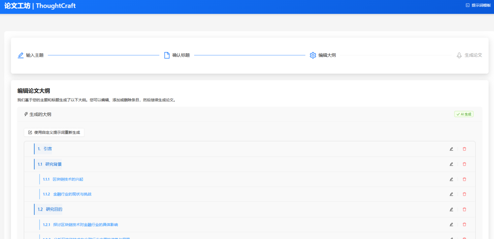
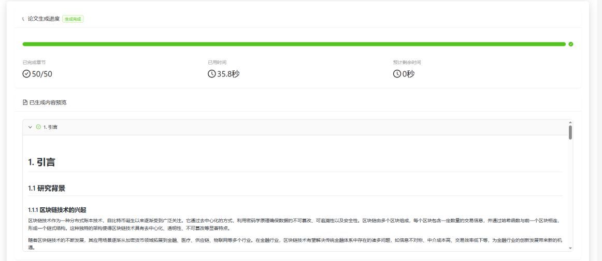

# 论文工坊 (Academic Paper Generator)

## 📚 项目介绍
一个基于大型语言模型的智能学术论文(水文)生成系统，可根据用户输入的主题自动生成专业、结构化的学术论文。

可通过下面的链接注册使用 deepseek/doubao 的API，推荐使用火山引擎的API(更稳定)

* 火山引擎注册链接 (aff) https://volcengine.com/L/MtpBPBFXmHQ/

* 硅基流动注册链接 (aff) https://cloud.siliconflow.cn/i/P9BJ94zl








## 🌟 功能特点

- **智能标题生成**：根据主题自动生成专业的论文标题，支持多个标题建议
- **大纲智能构建**：生成完整的论文结构大纲，支持自定义修改和调整
- **高质量内容生成**：基于大纲分段并行生成完整论文内容
- **自定义提示词**：支持自定义提示词模板，优化生成效果
- **多格式导出**：支持 Markdown 和 Word 格式导出
- **高级参数配置**：可调整温度、最大token数、top_p等参数
- **并发生成加速**：采用异步并发技术，显著提升生成速度
- **实时进度跟踪**：提供详细的生成进度和状态反馈

## 🔧 系统架构

- **后端**：FastAPI + Python
- **前端**：React + TypeScript + Ant Design
- **AI引擎**：OpenAI API (支持GPT-4o等模型)
- **文档转换**：Pandoc

## 📋 系统要求

- Python 3.10+
- Node.js 16+
- Pandoc 2.0+
- 操作系统：Windows/macOS/Linux

## 🚀 安装步骤

### 1. 克隆仓库

```bash
git clone https://github.com/openCUG/OpenWriter.git
cd OpenWriter
```

### 2. 配置环境变量

复制示例环境变量文件并填写您的API密钥：

```bash
cp .env.sample .env
```

编辑`.env`文件，填入以下信息：
```
OPENAI_API_KEY=your_api_key_here  # 您的OpenAI API密钥
OPENAI_BASE_URL=https://api.openai.com/v1  # API基础URL，可使用自定义端点
OPENAI_MODEL_NAME=gpt-4o  # 使用的模型名称
```

### 3. 安装后端依赖

```bash
pip install -r requirements.txt
```

### 4. 安装前端依赖

```bash
cd frontend
npm install
cd ..
```

### 5. 安装Pandoc（用于Markdown转Word）

#### Windows
```bash
winget install pandoc
```

#### macOS
```bash
brew install pandoc
```

#### Linux (Ubuntu/Debian)
```bash
sudo apt-get install pandoc
```

## 🖥️ 开发环境运行

### 1. 启动后端服务

```bash
python main.py
```

后端服务将在 http://localhost:8000 上运行。

### 2. 启动前端开发服务器

```bash
cd frontend
npm start
```

前端开发服务器将在 http://localhost:3000 上运行。

## 📦 打包部署

### 1. 构建前端

```bash
cd frontend
npm run build
cd ..
```

这将在`frontend/build`目录下生成静态文件。

#### 2. 启动生产服务器

```bash
python main.py
```

应用将在 http://localhost:8000 上运行，自动提供前端静态文件。


## 📝 使用指南

1. 访问应用主页
2. 输入论文主题（如"人工智能在医疗领域的应用"）
3. 点击"生成标题"，系统会提供多个标题建议
4. 选择或修改标题后，点击"生成大纲"
5. 查看并按需调整大纲结构
6. 点击"生成论文"开始创建完整内容
7. 等待生成完成（可实时查看进度）
8. 下载Markdown或Word格式的论文

## ⚙️ 高级配置

### 模型参数

- **Temperature**：控制输出的随机性（0.0-1.0）
- **Max Tokens**：每次请求的最大token数量
- **Top P**：控制输出的多样性
- **Chunk Size**：每个生成块的大小
- **并发请求数**：同时进行的API请求数量

### 自定义提示词

系统支持自定义提示词模板，可在界面中编辑以下模板：
- 标题生成模板
- 大纲生成模板
- 内容生成模板

## 🔍 故障排除

- **API密钥错误**：确保`.env`文件中的API密钥正确无误
- **生成超时**：尝试减小并发请求数或chunk大小
- **Pandoc错误**：确保正确安装了Pandoc并可在命令行中访问

反正我一点编程基础没有，用 cursor 2小时写出一个程序上架，已经赚了不少钱了。可以加我微信群聊聊怎么一起赚钱。这是我的二维码 (误

## 已知Bug

* 生成过程中剩余时间一直显示计算中
* 已用时间计时不停止
 